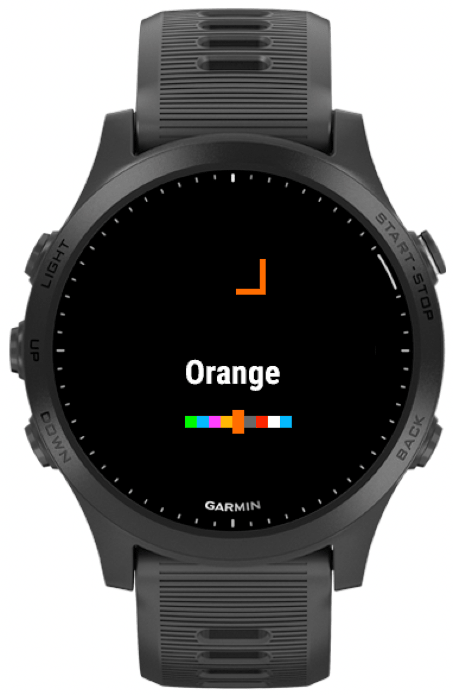
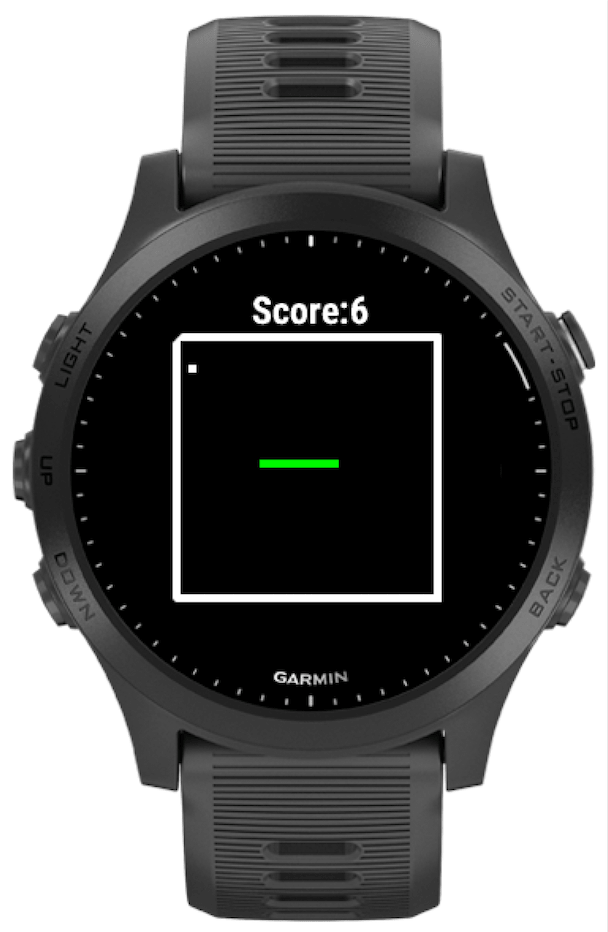
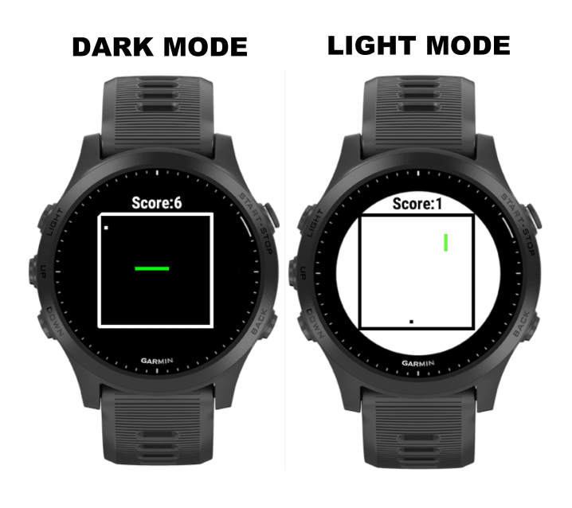

# SnakeIQ

This is an open source game for the Garmin ConnectIQ ecosystem. Recreating the classic snake game we all grew up playing, but now on your wrist!

# Conributing 

If you ever experience any bugs, or want to add compatibility for a device, please open up a PR and I will approve, merge and release the version to app store (with credit of course.)

# Game

# Device Support

- d2bravo
- d2bravo_titanium
- d2charlie
- d2delta
- d2deltapx
- d2deltas
- d2mach1
- descentg1
- descentmk1
- descentmk2
- descentmk2s
- enduro
- epix
- epix2
- fenix3
- fenix3_hr
- fenix5
- fenix5plus
- fenix5s
- fenix5splus
- fenix5x
- fenix5xplus
- fenix6
- fenix6pro
- fenix6s
- fenix6spro
- fenix6xpro
- fenixchronos
- fr230
- fr235
- fr245
- fr245m
- fr255
- fr255m
- fr255s
- fr255sm
- fr55
- fr630
- fr645
- fr645m
- fr735xt
- fr745
- fr920xt
- fr935
- fr945
- fr945lte
- fr955
- instinct2
- instinct2s
- legacyherocaptainmarvel
- legacyherofirstavenger
- legacysagadarthvader
- legacysagarey
- marqadventurer
- marqathlete
- marqaviator
- marqcaptain
- marqcommander
- marqdriver
- marqexpedition
- marqgolfer
- oregon7xx
- venu
- venu2
- venu2plus
- venu2s
- venud
- venusq
- venusq2
- venusq2m
- venusqm
- vivoactive
- vivoactive3
- vivoactive3d
- vivoactive3m
- vivoactive3mlte
- vivoactive4
- vivoactive4s
- vivoactive_hr
